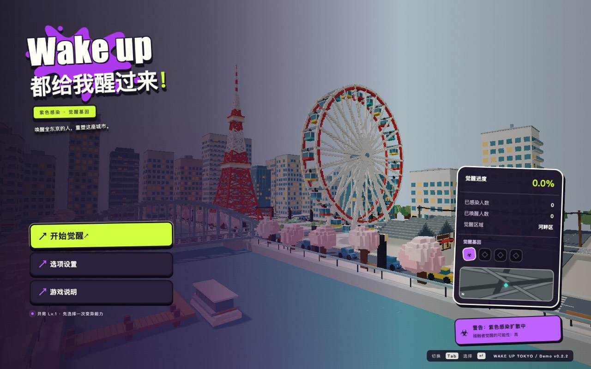
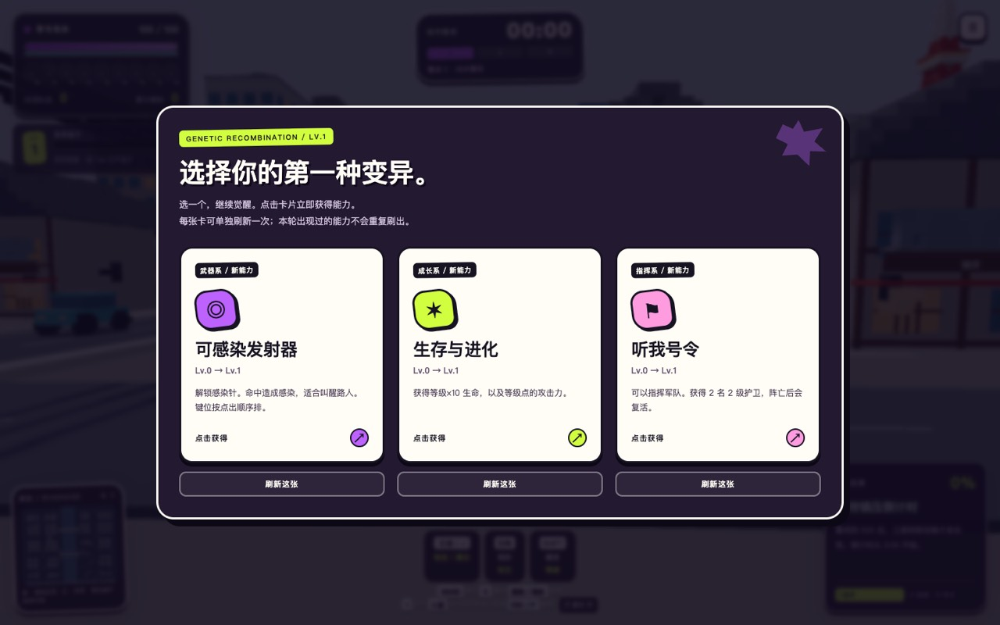

# Demo v0.2.2：墨迹街机 UI

主菜单、战斗信息、能力卡、暂停设置和结算采用统一的紫色感染、荧光绿、纸白和炭黑配色，配合墨迹标题、贴纸按钮和短促操作反馈。用户已在本地验收这一视觉方向。

## 界面预览

下图来自已验收的 ForgeaX 版本；共享的 index.html、main.js 和 ui.css 与本 PR 一致。

## 操作与兼容

- 能力卡单击立即领取，独立刷新和防重复领取保持有效；新增悬停抬起、按下反馈和“获得！”印章。
- 战斗按键拦截仅在战斗中生效，菜单和选卡支持 Tab / Enter / 空格。
- 战斗信息贴边排列，地图位于左下方；黄色 Boss 名称继续使用实心文字。
- 适配较小窗口，结算复盘独立滚动，主按钮保持可见；隐藏控件按 hidden 属性处理，新增动效尊重减少动态效果设置。
- 玩法、Boss 触发规则、依赖版本和存档格式保持 v0.2.1 的规则。

## 验证

- GitHub 源码布局：59 项游戏测试及生产构建通过；独立生产预览验证菜单 v0.2.2、新局、单击选卡、恢复战斗、鼠标捕获与暂停释放，浏览器未记录运行错误。
- ForgeaX 适配工程：另有 7 项版本管理测试通过，合计 66 项。
- 已在 ForgeaX 本机预览服务验证 1440×900 和 1024×650 的菜单、选卡、战斗与结算；单击领取、独立刷新、连续点击防重复、菜单和选卡键盘操作、鼠标捕获与暂停均通过。
- 胜利界面使用独立测试浏览器的胜利状态存档检查，用于 UI 验证；不代表本次额外完成了自然流程通关。

风格参考用户提供的[项目演示视频](https://www.xiaohongshu.com/explore/6ab6af12000000001500b891)中的战斗信息、墨迹提示和结算表达。主菜单与能力卡由本项目延展设计；录屏和参考项目素材未加入仓库。
